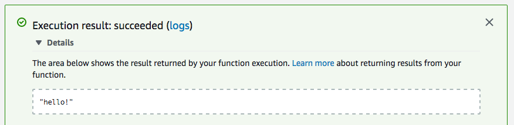
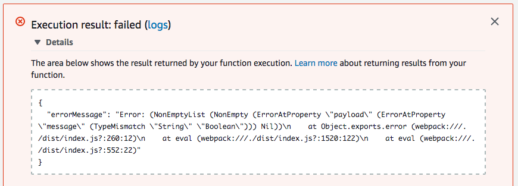

## PureScript Lambda Demo

A small demo to show how you can call PureScript from an AWS Lambda Handler.

All this demo does is accept an AWS Lambda event and attempt to extract a
a `String` from `payload.message`, passing the result off to Lambda's success
callback if it's successful or failing with a parse error if it's not.

### Build and Run the Demo

#### Building
To generate a Lambda function, clone this repository, install the dependencies 
using `npm`, and bundle up all the JS with webpack:

    git clone git@github.com:jkachmar/purescript-lambda-demo.git
    npm install
    npm run bundle

This will generate an output file at `dist/index.js` containing the full, 
bundled function.

#### Testing on Lambda
To run this demo on AWS Lambda, upload the file from `dist/index.js` like you 
would any other Lambda function, and test with the following test event payload:

    { "payload": { "message": "hello!" } }

...the handler will succeed:



If a bad payload is supplied, for example with a `Boolean` at `payload.message`:

    { "payload" { "message": false } }

...the handler will fail:



#### Testing Locally
To run this demo locally, open a `node` REPL in this directory and import the
bundled output:

    const { handler } = require('./dist/index.js');

Then call `handler` with a good payload, an empty argument, and a callback:

    handler({payload: {message: "hello!"}}, {}, (e, a) => { e ? console.log(e) : console.log(a); })

...and watch it succeed by printing the contents of `payload.message`:

    hello!
    
Alternatively, call `handler` with a bad payload, an empty argument, and a 
callback:

    handler({payload: {message: 0}}, {}, (e, a) => { e ? console.log(e) : console.log(a); })

...and watch it fail by printing the error and dumping an unhelpful stack trace:

```
Error: (NonEmptyList (NonEmpty (ErrorAtProperty "payload" (ErrorAtProperty "message" (TypeMismatch "String" "Number"))) Nil))
    at Object.exports.error (webpack:///./dist/index.js?:260:12)
    at eval (webpack:///./dist/index.js?:1520:122)
    at eval (webpack:///./dist/index.js?:552:22)
    at repl:1:1
    at ContextifyScript.Script.runInThisContext (vm.js:50:33)
    at REPLServer.defaultEval (repl.js:240:29)
    at bound (domain.js:301:14)
    at REPLServer.runBound [as eval] (domain.js:314:12)
    at REPLServer.onLine (repl.js:441:10)
    at emitOne (events.js:121:20)
```
